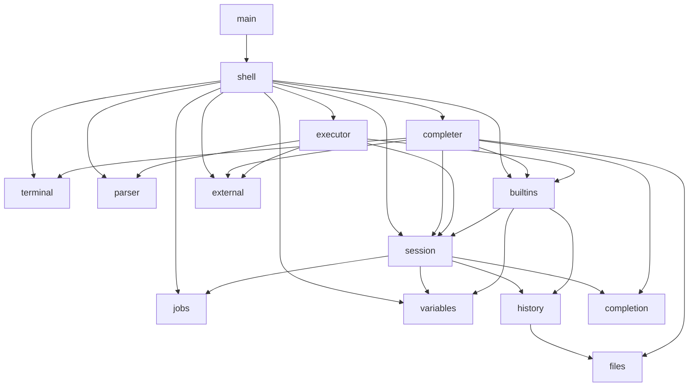

# Architecture

Entry point: `main` calls `shell.New(stdin, stdout, stderr).Run()`.

## Packages

| Package      | Responsibilities                                                                                      |
| ------------ | ----------------------------------------------------------------------------------------------------- |
| `shell`      | Runs the REPL loop, routes parsed input to execution, and coordinates jobs, history, and expansion.   |
| `terminal`   | Handles prompt display, raw-mode line editing, tab dispatch, history recall, and TTY output wrapping. |
| `parser`     | Parses input lines into commands, pipelines, redirects, and background flags.                         |
| `executor`   | Applies redirects and runs builtins, external programs, and pipelines.                                |
| `completer`  | Orchestrates tab completion for commands, arguments, filenames, and programmable scripts.             |
| `session`    | Holds mutable shell session state: jobs, history, variables, completion registry, and history file path. |
| `history`    | Maintains the in-memory command list and helpers to load, save, and format history entries            |
| `variables`  | Stores shell variables and expands parameter references in command arguments.                         |
| `jobs`       | Tracks background jobs and formats job listings for display.                                          |
| `completion` | Prefix-matches candidates, registers programmable completers, and runs completion scripts.            |
| `builtins`   | Implements and dispatches shell builtin commands.                                                     |
| `external`   | Resolves executables on PATH and runs external programs.                                              |
| `files`      | Lists directory entries for completion and provides line-oriented file I/O.                           |

## Dependency overview

## Class diagram

```mermaid
classDiagram
    direction TB

    class Shell {
        -terminal Terminal
        -executor Executor
        -completer Completer
        -session Session
        +Run() error
        +ExecuteLine(string) bool, error
        +HandleTab(TabState, string) TabResult
        +HistoryPrevious(int) string, bool
    }

    class Terminal {
        -tabHandler TabHandler
        -historyHandler HistoryHandler
        -rawTTY RawMode
        -reader bufio.Reader
        +ReadLine() string, bool, error
        +WriteLine(string)
        +Stdout() io.Writer
        +Stderr() io.Writer
        +PrepareRead() bool
        +Close() error
    }

    class HistoryHandler {
        <<interface>>
        +HistoryPrevious(int) string, bool
    }

    class RawMode {
        +PrepareRead() bool
        +Active() bool
        +Close() error
    }

    class TabHandler {
        <<interface>>
        +HandleTab(TabState, string) TabResult
    }

    class TabState {
        +PendingListings []string
    }

    class TabResult {
        +Buffer string
        +ListingsToShow []string
        +RingBell bool
    }

    class Completer {
        -session Session
        +HandleTab(TabState, string) TabResult
        +ApplyTabAction(TabState, string, string, []string) TabResult
    }

    class Executor {
        -stdin io.Reader
        -stdout io.Writer
        -stderr io.Writer
        +ExecuteBuiltin(Redirect, Session, []string) bool, error
        +ExecuteExternalForeground(Redirect, []string) error
        +ExecuteExternalBackground(Redirect, []string, func()) int, error
        +ExecutePipeline(Redirect, Session, [][]string) error
    }

    class Session {
        +Jobs Table
        +History List
        +Histfile string
        +Completion Registry
        +Variables Store
    }

    class List {
        +Add(string)
        +List() []Entry
        +ListLast(int) []Entry
        +Previous(int) string, bool
        +ReadFromFile(string) error
        +AppendFromFile(string) error
        +WriteToFile(string) error
        +AppendToFile(string) error
    }

    class Entry {
        +Number int
        +Command string
    }

    class Table {
        +Add(int, string) int
        +MarkDone(int)
        +ReapDone() []Job
        +List() []Job
    }

    class Job {
        +Number int
        +PID int
        +Command string
        +Status string
    }

    class Registry {
        +Register(string, string)
        +Unregister(string)
        +Lookup(string) string, bool
    }

    class Store {
        +Set(string, string)
        +Get(string) string, bool
    }

    class variables {
        <<package>>
        +IsValidIdentifier(string) bool
        +ExpandField(Store, string) string
        +ExpandFields(Store, []string) []string
    }

    class builtinsRegistry {
        +Register(string, Handler)
        +Run(string, []string, Context) bool, error
        +Is(string) bool
        +Names() []string
    }

    class Context {
        +Stdout io.Writer
        +Stderr io.Writer
        +Session Session
    }

    class builtins {
        <<package>>
        +IsBuiltin(string) bool
        +Names() []string
        +Run(string, []string, Context) bool, error
    }

    class parser {
        <<package>>
        +Tokenize(string) []string
        +ParseLine(string) Line
        +ParseCommand([]string) Command
        +ParsePipelineSegments([][]string) [][]string, Redirect
        +SplitPipelineTokens([]string) [][]string
        +ParseRedirect([]string) []string, Redirect
        +StripBackground([]string) []string, bool
    }

    class Line {
        +Pipeline bool
        +Commands [][]string
        +Redirect Redirect
        +Background bool
    }

    class Redirect {
        +StdoutPath string
        +StdoutAppend bool
        +StderrPath string
        +StderrAppend bool
    }

    class external {
        <<package>>
        +FindExecutableInPath(string) string, bool
        +FindAllExecutablesInPath() []string
        +New([]string, io.Writer, io.Writer) ExternalProgram, bool
    }

    class ExternalProgram {
        +Run() error
        +RunInBackground(func()) int, error
    }

    class completion {
        <<package>>
        +Complete(string, []string) string, []string, bool
        +RunCompleter(CompleterOptions) []string, error
    }

    class jobs {
        <<package>>
        +FormatLines([]Job) []string
        +WriteAll(io.Writer, []Job)
    }

    class files {
        <<package>>
        +ListInDir(string, string) []string
        +ReadLines(string) []string, error
        +WriteLines(string, []string) error
        +AppendLines(string, []string) error
    }

    class history {
        <<package>>
        +FormatLines([]Entry) []string
        +WriteAll(io.Writer, []Entry)
    }

    Shell --> Terminal
    Shell --> Executor
    Shell --> Completer
    Shell --> Session
    Shell ..|> TabHandler
    Shell ..|> HistoryHandler
    Shell ..> parser
    Shell ..> builtins
    Shell ..> external
    Shell ..> jobs

    Terminal --> TabHandler
    Terminal --> HistoryHandler
    Terminal --> RawMode
    TabHandler ..> TabState
    TabHandler ..> TabResult

    Completer --> Session
    Session --> Table
    Session --> List
    Session --> Registry
    Session --> Store
    Table --> Job
    List --> Entry

    Executor ..> Redirect
    Executor ..> builtins
    Executor ..> external
    Executor ..> Session

    builtins ..> builtinsRegistry
    builtins ..> Context
    Context --> Session
    builtins ..> variables
    Shell ..> variables

    parser ..> Line
    parser ..> Redirect
    external ..> ExternalProgram

    Completer ..> completion
    Completer ..> builtins
    Completer ..> external
    Completer ..> files
    history ..> files
```

