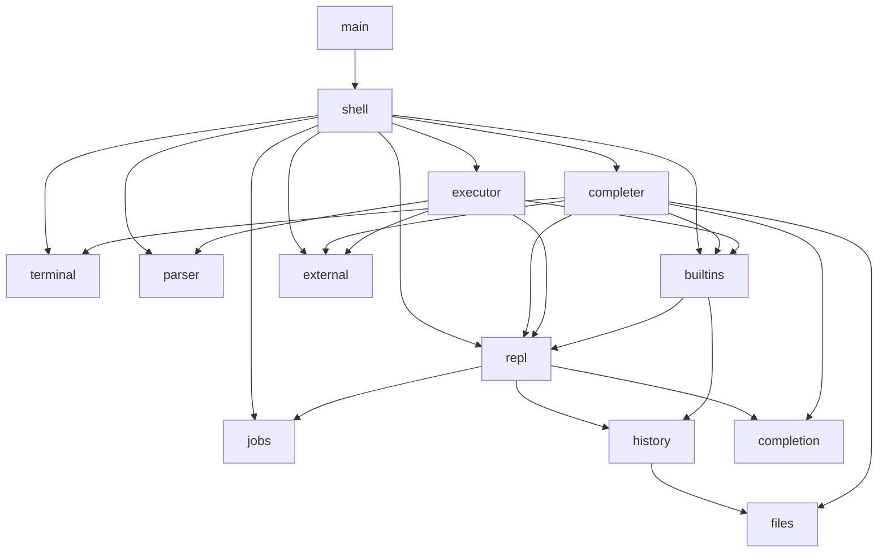
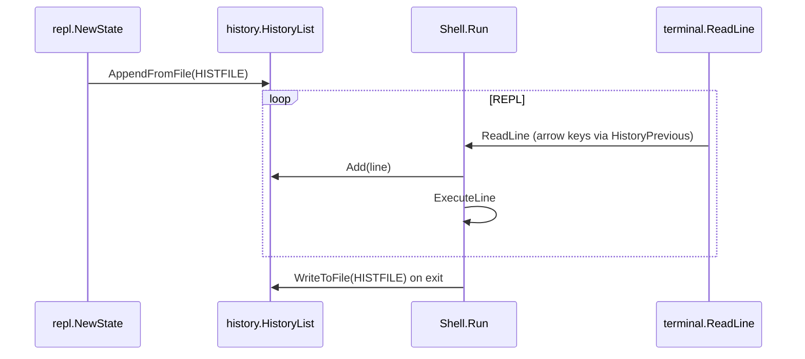

# Architecture

Entry point: `main` calls `shell.New(stdin, stdout, stderr).Run()`.

## Packages

| Package      | Responsibilities                                                                                                                              |
| ------------ | --------------------------------------------------------------------------------------------------------------------------------------------- |
| `shell`      | Top-level orchestrator: REPL loop, command routing (`commandFound`), job UX, history persistence on exit, and `repl.State` ownership (`shell.go`). |
| `terminal`   | User I/O: prompt, TTY raw mode (`RawMode`), line editing, Tab dispatch, arrow-key history recall, LF→CRLF wrapping (`terminal.go`, `input.go`, `history.go`, `raw.go`, `writer.go`, `output.go`, `tab.go`). |
| `parser`     | Pure syntax: tokenize, `ParseLine`, pipelines, redirects, background (`tokenize.go`, `parser.go`, `pipeline.go`, `redirect.go`, `background.go`). |
| `executor`   | Redirect lifecycle and command execution (`executor.go`, `run.go`, `pipeline.go`, `redirect.go`).                                             |
| `repl`       | REPL lifetime state: job table, history list, `HISTFILE` path, and completion registry (`repl.State` in `state.go`).                          |
| `history`    | In-memory command list, file read/write/append helpers, bash-style formatting (`history.go`). Path-agnostic: callers supply file paths.         |
| `completer`  | Tab completion orchestration (`completer.go`, `command.go`, `file.go`, `argument.go`).                                                        |
| `jobs`       | Background job table and bash-style formatting (`jobs.go`).                                                                                   |
| `completion` | Prefix matching (`Complete`), programmable completion registry (`registry.go`), script runner (`script.go`).                                    |
| `builtins`   | Builtin implementations (per-command files), unified registry (`registry.go`), per-invocation `Context`.                                      |
| `external`   | PATH lookup and `exec.Cmd` wrapper (`path.go`, `external.go`; platform splits in `path_unix.go` / `path_windows.go`).                         |
| `files`      | Directory listing for tab completion; line-oriented file I/O (`ReadLines`, `WriteLines`, `AppendLines`) (`files.go`).                       |

## Dependency overview

Leaf packages (`parser`, `jobs`, `completion`, `external`, `files`, `history`, `terminal`) have no internal app dependencies except `history` → `files`.

## Class diagram

`State` in the diagram is `repl.State`.

```mermaid
classDiagram
    direction TB

    class Shell {
        -terminal Terminal
        -executor Executor
        -completer Completer
        -state State
        +Run() error
        +ExecuteLine(string) bool, error
        +HandleTab(TabState, string) TabResult
        +HistoryPrevious(int) string, bool
    }

    class Terminal {
        -tabHandler TabHandler
        -historyHandler HistoryHandler
        -rawTTY RawMode
        -reader bufio.Reader
        +ReadLine() string, bool, error
        +WriteLine(string)
        +Stdout() io.Writer
        +Stderr() io.Writer
        +PrepareRead() bool
        +Close() error
    }

    class HistoryHandler {
        <<interface>>
        +HistoryPrevious(int) string, bool
    }

    class RawMode {
        +PrepareRead() bool
        +Active() bool
        +Close() error
    }

    class TabHandler {
        <<interface>>
        +HandleTab(TabState, string) TabResult
    }

    class TabState {
        +PendingListings []string
    }

    class TabResult {
        +Buffer string
        +ListingsToShow []string
        +RingBell bool
    }

    class Completer {
        -state State
        +HandleTab(TabState, string) TabResult
        +ApplyTabAction(TabState, string, string, []string) TabResult
    }

    class Executor {
        -stdin io.Reader
        +ExecuteBuiltin(Outputs, State, []string) bool, error
        +ExecuteExternalForeground(Outputs, []string) error
        +ExecuteExternalBackground(Outputs, []string, func()) int, error
        +ExecutePipeline(Outputs, State, [][]string) error
    }

    class Outputs {
        +Stdout io.Writer
        +Stderr io.Writer
        +Redirect Redirect
    }

    class State {
        +Jobs JobTable
        +History HistoryList
        +Histfile string
        +Completion CompletionRegistry
    }

    class HistoryList {
        +Add(string)
        +List() []Entry
        +ListLast(int) []Entry
        +Previous(int) string, bool
        +ReadFromFile(string) error
        +AppendFromFile(string) error
        +WriteToFile(string) error
        +AppendToFile(string) error
    }

    class Entry {
        +Number int
        +Command string
    }

    class JobTable {
        +Add(int, string) int
        +MarkDone(int)
        +ReapDone() []Job
        +List() []Job
    }

    class Job {
        +Number int
        +PID int
        +Command string
        +Status string
    }

    class CompletionRegistry {
        +Register(string, string)
        +Unregister(string)
        +Lookup(string) string, bool
    }

    class BuiltinRegistry {
        +Register(string, Handler)
        +Run(string, []string, Context) bool, error
        +Is(string) bool
        +Names() []string
    }

    class Context {
        +Stdout io.Writer
        +Stderr io.Writer
        +State State
    }

    class builtins {
        <<package>>
        +IsBuiltin(string) bool
        +Names() []string
        +Run(string, []string, Context) bool, error
    }

    class parser {
        <<package>>
        +Tokenize(string) []string
        +ParseLine(string) Line
        +ParseCommand([]string) Command
        +ParsePipelineSegments([][]string) [][]string, Redirect
        +SplitPipelineTokens([]string) [][]string
        +ParseRedirect([]string) []string, Redirect
        +StripBackground([]string) []string, bool
    }

    class Line {
        +Pipeline bool
        +Commands [][]string
        +Redirect Redirect
        +Background bool
    }

    class Redirect {
        +StdoutPath string
        +StdoutAppend bool
        +StderrPath string
        +StderrAppend bool
    }

    class external {
        <<package>>
        +FindExecutableInPath(string) string, bool
        +FindAllExecutablesInPath() []string
        +New([]string, io.Writer, io.Writer) ExternalProgram, bool
    }

    class ExternalProgram {
        +Run() error
        +RunInBackground(func()) int, error
    }

    class completion {
        <<package>>
        +Complete(string, []string) string, []string, bool
        +RunCompleter(CompleterOptions) []string, error
    }

    class jobs {
        <<package>>
        +FormatLines([]Job) []string
        +WriteAll(io.Writer, []Job)
    }

    class files {
        <<package>>
        +ListInDir(string, string) []string
        +ReadLines(string) []string, error
        +WriteLines(string, []string) error
        +AppendLines(string, []string) error
    }

    class history {
        <<package>>
        +FormatLines([]Entry) []string
        +WriteAll(io.Writer, []Entry)
    }

    Shell --> Terminal
    Shell --> Executor
    Shell --> Completer
    Shell --> State
    Shell ..|> TabHandler
    Shell ..|> HistoryHandler
    Shell ..> parser
    Shell ..> builtins
    Shell ..> external
    Shell ..> jobs

    Terminal --> TabHandler
    Terminal --> HistoryHandler
    Terminal --> RawMode
    TabHandler ..> TabState
    TabHandler ..> TabResult

    Completer --> State
    State --> JobTable
    State --> HistoryList
    State --> CompletionRegistry
    JobTable --> Job
    HistoryList --> Entry

    Executor --> Outputs
    Outputs --> Redirect
    Executor ..> builtins
    Executor ..> external
    Executor ..> State

    builtins ..> BuiltinRegistry
    builtins ..> Context
    Context --> State

    parser ..> Line
    parser ..> Redirect
    external ..> ExternalProgram

    Completer ..> completion
    Completer ..> builtins
    Completer ..> external
    Completer ..> files
    history ..> files
```

## REPL loop

Owned by `Shell.Run()`:

1. `terminal.PrepareRead()` — re-enable raw mode (external programs may restore cooked mode)
2. `writeReapedJobs()` — `state.Jobs.ReapDone()` → `jobs.FormatLines` → `terminal.WriteLine` each line
3. `terminal.ReadLine()` — up/down arrows browse history via `HistoryHandler` when raw mode is active
4. `ExecuteLine(line)` — `state.History.Add(line)`, then `parser.ParseLine`, `commandFound`, dispatch to `executor`
5. Repeat until exit or EOF

On exit, a deferred handler in `Run()` writes `state.History` to `state.Histfile` when `HISTFILE` was set at startup.

`ExecuteLine` branches on `parsed.Pipeline`: single commands go to `executeCommand`; pipelines go to `executePipeline` (which validates every segment via `validatePipelineSegments`).

## Tab completion

Owned by `completer` package; `Shell.HandleTab` delegates to `completer.Completer`.

| File           | Role                                                               |
| -------------- | ------------------------------------------------------------------ |
| `completer.go` | Routing, programmable completion (`BuildCompleterOptions`), double-Tab UX (`ApplyTabAction`) |
| `command.go`   | First-token completion: `builtins.Names` + PATH executables        |
| `file.go`      | Filename candidate sourcing via `files.ListInDir`                  |
| `argument.go`  | Last-argument prefix matching (files and programmable candidates)  |

Flow:

1. User presses Tab during `terminal.ReadLine()`
2. `terminal` calls `tabHandler.HandleTab(state, buffer)` — implemented by `Shell`
3. `Completer.completeBuffer` routes to command, programmable, or filename completion
4. `completion.Complete` runs prefix matching on gathered candidates
5. `ApplyTabAction` applies double-Tab logic (bell on first Tab, listings on second)
6. `terminal` updates the buffer or shows match listings

The `complete` builtin registers and unregisters scripts via `repl.State.Completion` (`completion.CompletionRegistry`).

## Terminal I/O

- **Raw mode** (`terminal/raw.go`, type `RawMode`): byte-at-a-time input so Tab, Backspace, arrow-key history, and completion listings work. Falls back to line-based reads when stdin is not a TTY (tests).
- **Command writers** (`terminal.Stdout()` / `Stderr()`): called at execution time, not cached. When raw mode is active, `WrapWriter` (`writer.go`) translates `\n` → `\r\n` so each line starts at column 0.
- **Input**: `bufio.Reader` on stdin for `ReadLine`; `RawMode` holds the `*os.File` for `MakeRaw` / `Restore`.
- **Tab types** (`terminal/tab.go`): `TabHandler` interface, `TabState`, `TabResult` — keeps completion semantics out of `terminal`.
- **History recall** (`terminal/history.go`, `input.go`): `HistoryHandler` interface; `historyBrowseState` tracks up/down navigation on the current prompt line. `handleEscapeSequence` handles CSI arrow sequences (`ESC [ A` / `ESC [ B`); `Shell` implements `HistoryPrevious` by delegating to `state.History.Previous`. Manual edits reset browse position.

## Parsing

`parser.ParseLine` (`parser/parser.go`) is the single entry point for line parsing:

- Single command → `ParseCommand` (`ParseRedirect` + `StripBackground`)
- Pipeline → `SplitPipelineTokens` + `ParsePipelineSegments` (redirect on final segment; background `&` stripped)

## Executor

Public API lives in `executor.go`. Private stage runners live in `run.go`; pipeline wiring in `pipeline.go`; redirect open/close in `redirect.go`.

| Method                      | Role                                                                          |
| --------------------------- | ----------------------------------------------------------------------------- |
| `ExecuteBuiltin`            | `withOutputs` → `runBuiltin` → `builtins.Run`                                 |
| `ExecuteExternalForeground` | `withOutputs` → `runExternal` (stdin from executor)                           |
| `ExecuteExternalBackground` | `withOutputs` → `runExternalBackground`; returns PID only                     |
| `ExecutePipeline`           | `withOutputs` → `runPipeline` (goroutine per stage, `io.Pipe` between stages) |

Shared private runners in `run.go`:

- `runBuiltin` — builds `builtins.Context`; drains pipe stdin for middle pipeline builtins via `runDrainingStdin`
- `runExternal` — `external.New` + `Run`
- `runExternalBackground` — `RunInBackground` with caller-supplied `onExit` callback
- `nonExitError` — swallows `exec.ExitError` for foreground commands

`Shell` builds `executor.Outputs` on each command/pipeline from `terminal.Stdout()`, `terminal.Stderr()`, and the parsed redirect. `repl.State` is passed per call for builtins and pipeline stages that need jobs/completion.

## Builtin commands

`builtins` package holds implementations and a unified registry (`registry.go`) patterned after `completion/registry.go`. Each command self-registers via unexported `register()` in its file's `init()`.

Registered builtins: `cd`, `complete`, `echo`, `exit`, `history`, `jobs`, `pwd`, `type`.

| Concern                                     | Owner                                                            |
| ------------------------------------------- | ---------------------------------------------------------------- |
| Builtin implementations                     | Per-command files (`echo.go`, `cd.go`, `exit.go`, …)             |
| Registry (`BuiltinRegistry`)              | `builtins/registry.go` — `Run`, `IsBuiltin`, `Names`             |
| REPL lifetime state (jobs, history, completion) | `repl.State`, owned by `Shell`                                   |
| Per-invocation I/O and state refs           | `builtins.Context` (`Stdout`, `Stderr`, `State *repl.State`)     |
| Invoking builtins                           | `Executor` → `builtins.Run`                                      |
| Routing builtin vs external                 | `Shell.ExecuteLine` via `commandFound` and `builtins.IsBuiltin`    |
| Command resolution (`type`, pre-exec check) | `builtins/type.go` (`Type`) and `shell.commandFound`              |

## Command resolution and shell messages

`commandFound` (package-private helper in `shell.go`) checks `builtins.IsBuiltin` then `external.FindExecutableInPath` before execution. The `type` builtin uses the same classification inline in `Type` with different message formatting.

`Shell.ExecuteLine` resolves the command before calling executor:

- `commandFound` → `CommandNotFoundMessage` via `terminal.WriteLine`, or continue
- `builtins.IsBuiltin` → `ExecuteBuiltin`
- `parsed.Background` → `executeBackgroundCommand`
- otherwise → `ExecuteExternalForeground`

Background jobs: `executeBackgroundCommand` starts the process via `ExecuteExternalBackground`, registers the job in `state.Jobs` (`Add`, `MarkDone` callback), and prints `[n] pid`. Reaped jobs print before the next prompt via `writeReapedJobs`.

## Command history

The `history` package is path-agnostic: it stores commands in memory and exposes file helpers that take an explicit path. `HISTFILE` policy (read on startup, write on exit) lives in `repl` and `shell`; the builtin supplies paths for `-r`, `-w`, and `-a`.

| Concern                         | Owner                                                                 |
| ------------------------------- | --------------------------------------------------------------------- |
| In-memory command list          | `history.HistoryList` on `repl.State`                                 |
| `HISTFILE` path                 | `repl.State.Histfile` from `os.Getenv("HISTFILE")` in `repl.NewState` |
| Load history on startup         | `repl.NewState` → `History.AppendFromFile(histfile)` (missing file OK) |
| Record each executed line       | `shell.ExecuteLine` → `state.History.Add(line)` before parsing       |
| Persist on shell exit           | `shell.Run` defer → `state.History.WriteToFile(state.Histfile)`       |
| List / file ops builtin         | `builtins/history.go` → `history.HistoryList` methods                 |
| Up/down arrow recall            | `terminal/history.go` + `input.go`; `Shell.HistoryPrevious`           |
| Line-oriented file I/O          | `files.ReadLines`, `files.WriteLines`, `files.AppendLines`            |

### `history` package

`HistoryList` (`history/history.go`) is a mutex-protected slice of command strings.

| Method           | Role                                                                                      |
| ---------------- | ----------------------------------------------------------------------------------------- |
| `Add`            | Append a command after the user submits a line                                            |
| `List` / `ListLast` | Snapshot entries with bash-style line numbers (`Entry.Number` preserves original index) |
| `Previous`       | Random access for arrow recall (`stepsBack` 0 = most recent)                              |
| `ReadFromFile`   | Append lines from a path; errors propagate (used by `history -r`)                       |
| `AppendFromFile` | Append lines; empty path and missing file are no-ops (used for `HISTFILE` load)           |
| `WriteToFile`    | Overwrite a path with the full list (used for `HISTFILE` exit and `history -w`)           |
| `AppendToFile`   | Append commands since the last file read/write/append (`history -a`; tracks `lastAppended`) |

Display helpers `FormatLines` and `WriteAll` produce bash-style output (`%5d  %s` per entry). The builtin delegates listing to `builtins.History`, which chooses `List` vs `ListLast` from an optional numeric limit.

### `history` builtin

| Invocation        | Behavior                                                              |
| ----------------- | --------------------------------------------------------------------- |
| `history`         | Print full history via `history.WriteAll`                             |
| `history n`       | Print last *n* entries (`n` must be a positive integer)               |
| `history -r path` | `ReadFromFile(path)` — append file contents; errors to stderr         |
| `history -w path` | `WriteToFile(path)` — overwrite file with full list                   |
| `history -a path` | `AppendToFile(path)` — append only commands added since last file op  |

### Persistence flow

## Background jobs

| Concern              | Owner                                              |
| -------------------- | -------------------------------------------------- |
| Job table data       | `jobs.JobTable` on `repl.State`                    |
| Start + `[n] pid` UX | `shell.executeBackgroundCommand`                   |
| Mark done on exit    | `onExit` callback from executor → `shell`          |
| Reap + print         | `shell.writeReapedJobs` → `jobs.FormatLines`       |
| List on demand       | `builtins/jobs` → `jobs.WriteAll`                  |
