# Architecture

Entry point: `main` calls `shell.New(stdin, stdout, stderr).Run()`.

| Package      | Responsibilities                                                                                                                              |
| ------------ | --------------------------------------------------------------------------------------------------------------------------------------------- |
| `shell`      | Top-level orchestrator: REPL loop (`shell.go`), tab completion (`tab.go`), command routing, and `builtins.State` ownership.                   |
| `terminal`   | User I/O: prompt, raw-mode line editing, Tab key dispatch, and LF→CRLF wrapping for command output.                                           |
| `parser`     | Tokenizes and parses input into commands, arguments, pipelines, and redirects.                                                                |
| `executor`   | Redirect lifecycle and command execution: builtins, external programs, and pipelines (`executor.go`, `run.go`, `pipeline.go`, `redirect.go`). |
| `jobs`       | Tracks background jobs: add, mark done, reap, and list.                                                                                       |
| `completion` | Tab match logic (`Complete`), programmable completion registry (`CompletionRegistry`), and completer script execution (`RunCompleter`).       |
| `builtins`   | Builtin implementations, dispatch (`Run`, `IsBuiltin`, `Names`), and session types (`State`, `Context`).                                      |
| `external`   | PATH lookup and running external programs (`ExternalProgram`).                                                                                |
| `files`      | Directory listing for file tab completion.                                                                                                    |

## Class diagram

```mermaid
classDiagram
    class Shell {
        -terminal Terminal
        -executor Executor
        -state State
        +Run() error
        +ExecuteLine(string) bool, error
        +HandleTab(TabState, string) TabResult
    }

    class parser {
        <<package>>
        +Tokenize(string) []string
        +SplitPipelineTokens([]string) [][]string
        +StripBackground([]string) []string, bool
        +ParseRedirect([]string) []string, Redirect
    }

    class Redirect {
        +StdoutPath string
        +StdoutAppend bool
        +StderrPath string
        +StderrAppend bool
    }

    parser ..> Redirect

    class Outputs {
        +Stdout io.Writer
        +Stderr io.Writer
        +Redirect Redirect
    }

    class Executor {
        -stdin io.Reader
        +New(io.Reader)
        +ExecuteBuiltin(Outputs, State, []string) bool, error
        +ExecuteExternalForeground(Outputs, []string) error
        +ExecuteExternalBackground(Outputs, []string, func()) int, error
        +ExecutePipeline(Outputs, State, [][]string) error
        +ParsePipelineSegments([][]string) [][]string, Redirect
    }

    class external {
        <<package>>
        +FindExecutableInPath(string) string, bool
        +FindAllExecutablesInPath() []string
        +New([]string, io.Writer, io.Writer) ExternalProgram, bool
    }

    class ExternalProgram {
        +Run() error
        +RunInBackground(func()) int, error
    }

    external ..> ExternalProgram

    class builtins {
        <<package>>
        +IsBuiltin(string) bool
        +Names() []string
        +Run(string, []string, Context) bool, error
    }

    class State {
        +Jobs JobTable
        +Completion CompletionRegistry
    }

    class Context {
        +Stdout io.Writer
        +Stderr io.Writer
        +State State
    }

    builtins ..> State
    builtins ..> Context

    class Job {
        +Number int
        +PID int
        +Command string
        +Status string
    }

    class JobTable {
        +Add(int, string) int
        +MarkDone(int)
        +ReapDone() []Job
        +List() []Job
    }

    class jobs {
        <<package>>
        +FormatLines([]Job) []string
    }

    JobTable ..> Job
    jobs ..> Job

    class completion {
        <<package>>
        +Complete(string, []string) string, []string, bool
        +RunCompleter(CompleterOptions) []string, error
    }

    class CompletionRegistry {
        +Register(string, string)
        +Unregister(string)
        +Lookup(string) string, bool
    }

    class CompleterOptions {
        +Path string
        +Command string
        +CurrentWord string
        +PreviousWord string
        +CompLine string
        +CompPoint int
    }

    completion ..> CompletionRegistry
    completion ..> CompleterOptions

    class files {
        <<package>>
        +ListInDir(string, string) []string
    }

    class TabHandler {
        <<interface>>
        +HandleTab(TabState, string) TabResult
    }

    class TabState {
        +pendingListings []string
    }

    class TabResult {
        +Buffer string
        +ListingsToShow []string
        +RingBell bool
    }

    class Terminal {
        -tabHandler TabHandler
        +ReadLine() string, bool, error
        +WriteLine(string)
        +Stdout() io.Writer
        +Stderr() io.Writer
        +PrepareRead() bool
        +Close() error
    }

    TabHandler ..> TabState
    TabHandler ..> TabResult

    Executor ..> Outputs
    Executor ..> Redirect
    Executor ..> external
    Executor ..> builtins
    Shell --> Terminal : terminal
    Shell --> Executor : executor
    Shell --> State : state
    Shell ..|> TabHandler : implements
    Shell ..> parser
    Shell ..> external
    Shell ..> completion
    Shell ..> files
    Shell ..> builtins
    Shell ..> jobs
    Terminal --> TabHandler : tabHandler
    Executor ..> Context : builds per call
```

## REPL loop

Owned by `Shell.Run()`:

1. `terminal.PrepareRead()` — re-enable raw mode (external programs may restore cooked mode)
2. `writeReapedJobs()` — `state.Jobs.ReapDone()` → `jobs.FormatLines` → `terminal.WriteLine` each line
3. `terminal.ReadLine()`
4. `ExecuteLine(line)` — `parser.*`, resolve command, dispatch to `executor`
5. Repeat until exit or EOF

## Tab completion

Owned by `shell/tab.go`.

1. User presses Tab during `terminal.ReadLine()`
2. `terminal` calls `tabHandler.HandleTab(state, buffer)` — implemented by `Shell`
3. `Shell.completeBuffer` routes to command, programmable, or filename completion:
  - **Commands:** deduplicated `builtins.Names` + PATH (`commandCandidates`)
  - **Programmable:** `buildCompleterOptions` → `state.Completion.Lookup` → `completion.RunCompleter`
  - **Files:** `files.ListInDir` for the current argument
4. `Shell` calls `completion.Complete` on the gathered candidates
5. `Shell` applies double-Tab logic (bell on first Tab, listings on second) and returns `TabResult`
6. `terminal` updates the buffer or shows match listings

The `complete` builtin registers and unregisters scripts via `state.Completion`.

## Terminal I/O

- **Raw mode** (`terminal/raw.go`): byte-at-a-time input so Tab, Backspace, and completion listings work. Falls back to line-based reads when stdin is not a TTY (tests).
- **Command writers** (`terminal.Stdout()` / `Stderr()`): called at execution time, not cached. When raw mode is active, `WrapWriter` translates `\n` → `\r\n` so each line starts at column 0 (raw mode only moves down on `\n`).
- **Input**: `bufio.Reader` on stdin for `ReadLine`; `Session` holds the `*os.File` for `MakeRaw` / `Restore`.

## Executor

Public API lives in `executor.go`. Private stage runners live in `run.go`; pipeline wiring in `pipeline.go`; redirect open/close in `redirect.go`.

| Method                      | Role                                                                          |
| --------------------------- | ----------------------------------------------------------------------------- |
| `ExecuteBuiltin`            | `withOutputs` → `runBuiltin` → `builtins.Run`                                 |
| `ExecuteExternalForeground` | `withOutputs` → `runExternal` (stdin from executor)                           |
| `ExecuteExternalBackground` | `withOutputs` → `runExternalBackground`; returns PID only                     |
| `ExecutePipeline`           | `withOutputs` → `runPipeline` (goroutine per stage, `io.Pipe` between stages) |

`Shell` builds `executor.Outputs` on each command/pipeline from `terminal.Stdout()`, `terminal.Stderr()`, and the parsed redirect. `builtins.State` is passed per call for builtins and pipeline stages that need jobs/completion.

Shared private runners in `run.go`:

- `runBuiltin` — builds `builtins.Context`; drains pipe stdin for middle pipeline builtins via `runDrainingStdin`
- `runExternal` — `external.New` + `Run`
- `runExternalBackground` — `RunInBackground` with caller-supplied `onExit` callback

## Builtin commands

`builtins` package holds implementations and a fixed handler table (package-level `IsBuiltin`, `Names`, `Run`).

| Concern                                              | Owner                                                                            |
| ---------------------------------------------------- | -------------------------------------------------------------------------------- |
| Builtin implementations (`echo`, `cd`, …)            | `builtins` package                                                               |
| Dispatch (`Run`, `IsBuiltin`, `Names`)               | `builtins` package functions                                                     |
| Stable session state (jobs, completion registry)     | `builtins.State`, owned by `Shell`                                               |
| Per-invocation I/O and state refs                    | `builtins.Context` (`Stdout`, `Stderr`, `State`)                                 |
| Invoking builtins (single command or pipeline stage) | `Executor.ExecuteBuiltin` / `runBuiltin` → `builtins.Run`                        |
| Routing builtin vs external                          | `Shell.ExecuteLine` via `builtins.IsBuiltin` and `external.FindExecutableInPath` |
| Builtin names for tab completion                     | `shell/tab.go` via `commandCandidates` (`builtins.Names` + PATH)                 |

Individual builtins stay as testable functions (e.g. `Echo`, `Cd`, `Type`) with thin handlers registered in the handler table.

## Command resolution and shell messages

`Shell.ExecuteLine` resolves the command before calling executor:

- `builtins.IsBuiltin` → `ExecuteBuiltin`
- `external.FindExecutableInPath` → foreground via `ExecuteExternalForeground`, or background via `executeBackgroundCommand`
- Neither → `terminal.WriteLine` with command-not-found message

Background jobs: `executeBackgroundCommand` starts the process via `ExecuteExternalBackground`, registers the job in `state.Jobs` (`Add`, `MarkDone` callback), and prints `[n] pid`.