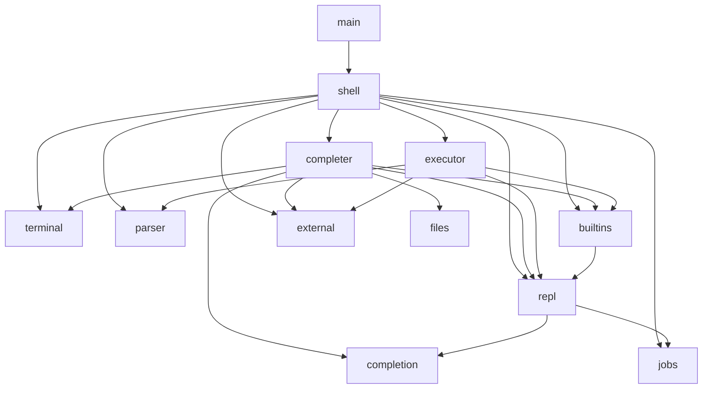
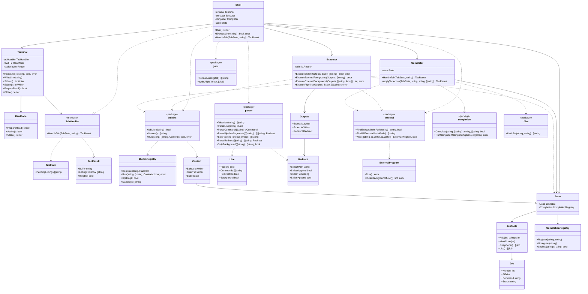

# Architecture

Entry point: `main` calls `shell.New(stdin, stdout, stderr).Run()`.

## Packages

| Package      | Responsibilities                                                                                                                              |
| ------------ | --------------------------------------------------------------------------------------------------------------------------------------------- |
| `shell`      | Top-level orchestrator: REPL loop, command routing (`commandFound`), job UX, and `repl.State` ownership (`shell.go`).                         |
| `terminal`   | User I/O: prompt, TTY raw mode (`RawMode`), line editing, Tab dispatch, LF→CRLF wrapping (`terminal.go`, `input.go`, `raw.go`, `writer.go`, `output.go`, `tab.go`). |
| `parser`     | Pure syntax: tokenize, `ParseLine`, pipelines, redirects, background (`tokenize.go`, `parser.go`, `pipeline.go`, `redirect.go`, `background.go`). |
| `executor`   | Redirect lifecycle and command execution (`executor.go`, `run.go`, `pipeline.go`, `redirect.go`).                                             |
| `repl`       | REPL lifetime state: job table and completion registry (`repl.State` in `state.go`).                                                          |
| `completer`  | Tab completion orchestration (`completer.go`, `command.go`, `file.go`, `argument.go`).                                                        |
| `jobs`       | Background job table and bash-style formatting (`jobs.go`).                                                                                   |
| `completion` | Prefix matching (`Complete`), programmable completion registry (`registry.go`), script runner (`script.go`).                                    |
| `builtins`   | Builtin implementations (per-command files), unified registry (`registry.go`), per-invocation `Context`.                                      |
| `external`   | PATH lookup and `exec.Cmd` wrapper (`path.go`, `external.go`; platform splits in `path_unix.go` / `path_windows.go`).                         |
| `files`      | Directory listing for file tab completion (`files.go`).                                                                                       |

## Dependency overview

Leaf packages (`parser`, `jobs`, `completion`, `external`, `files`, `terminal`) have no internal app dependencies.

## Class diagram

`State` in the diagram is `repl.State`.

## REPL loop

Owned by `Shell.Run()`:

1. `terminal.PrepareRead()` — re-enable raw mode (external programs may restore cooked mode)
2. `writeReapedJobs()` — `state.Jobs.ReapDone()` → `jobs.FormatLines` → `terminal.WriteLine` each line
3. `terminal.ReadLine()`
4. `ExecuteLine(line)` — `parser.ParseLine`, `commandFound`, dispatch to `executor`
5. Repeat until exit or EOF

`ExecuteLine` branches on `parsed.Pipeline`: single commands go to `executeCommand`; pipelines go to `executePipeline` (which validates every segment via `validatePipelineSegments`).

## Tab completion

Owned by `completer` package; `Shell.HandleTab` delegates to `completer.Completer`.

| File           | Role                                                               |
| -------------- | ------------------------------------------------------------------ |
| `completer.go` | Routing, programmable completion (`BuildCompleterOptions`), double-Tab UX (`ApplyTabAction`) |
| `command.go`   | First-token completion: `builtins.Names` + PATH executables        |
| `file.go`      | Filename candidate sourcing via `files.ListInDir`                  |
| `argument.go`  | Last-argument prefix matching (files and programmable candidates)  |

Flow:

1. User presses Tab during `terminal.ReadLine()`
2. `terminal` calls `tabHandler.HandleTab(state, buffer)` — implemented by `Shell`
3. `Completer.completeBuffer` routes to command, programmable, or filename completion
4. `completion.Complete` runs prefix matching on gathered candidates
5. `ApplyTabAction` applies double-Tab logic (bell on first Tab, listings on second)
6. `terminal` updates the buffer or shows match listings

The `complete` builtin registers and unregisters scripts via `repl.State.Completion` (`completion.CompletionRegistry`).

## Terminal I/O

- **Raw mode** (`terminal/raw.go`, type `RawMode`): byte-at-a-time input so Tab, Backspace, and completion listings work. Falls back to line-based reads when stdin is not a TTY (tests).
- **Command writers** (`terminal.Stdout()` / `Stderr()`): called at execution time, not cached. When raw mode is active, `WrapWriter` (`writer.go`) translates `\n` → `\r\n` so each line starts at column 0.
- **Input**: `bufio.Reader` on stdin for `ReadLine`; `RawMode` holds the `*os.File` for `MakeRaw` / `Restore`.
- **Tab types** (`terminal/tab.go`): `TabHandler` interface, `TabState`, `TabResult` — keeps completion semantics out of `terminal`.

## Parsing

`parser.ParseLine` (`parser/parser.go`) is the single entry point for line parsing:

- Single command → `ParseCommand` (`ParseRedirect` + `StripBackground`)
- Pipeline → `SplitPipelineTokens` + `ParsePipelineSegments` (redirect on final segment; background `&` stripped)

## Executor

Public API lives in `executor.go`. Private stage runners live in `run.go`; pipeline wiring in `pipeline.go`; redirect open/close in `redirect.go`.

| Method                      | Role                                                                          |
| --------------------------- | ----------------------------------------------------------------------------- |
| `ExecuteBuiltin`            | `withOutputs` → `runBuiltin` → `builtins.Run`                                 |
| `ExecuteExternalForeground` | `withOutputs` → `runExternal` (stdin from executor)                           |
| `ExecuteExternalBackground` | `withOutputs` → `runExternalBackground`; returns PID only                     |
| `ExecutePipeline`           | `withOutputs` → `runPipeline` (goroutine per stage, `io.Pipe` between stages) |

Shared private runners in `run.go`:

- `runBuiltin` — builds `builtins.Context`; drains pipe stdin for middle pipeline builtins via `runDrainingStdin`
- `runExternal` — `external.New` + `Run`
- `runExternalBackground` — `RunInBackground` with caller-supplied `onExit` callback
- `nonExitError` — swallows `exec.ExitError` for foreground commands

`Shell` builds `executor.Outputs` on each command/pipeline from `terminal.Stdout()`, `terminal.Stderr()`, and the parsed redirect. `repl.State` is passed per call for builtins and pipeline stages that need jobs/completion.

## Builtin commands

`builtins` package holds implementations and a unified registry (`registry.go`) patterned after `completion/registry.go`. Each command self-registers via unexported `register()` in its file's `init()`.

Registered builtins: `cd`, `complete`, `echo`, `exit`, `jobs`, `pwd`, `type`.

| Concern                                     | Owner                                                            |
| ------------------------------------------- | ---------------------------------------------------------------- |
| Builtin implementations                     | Per-command files (`echo.go`, `cd.go`, `exit.go`, …)             |
| Registry (`BuiltinRegistry`)              | `builtins/registry.go` — `Run`, `IsBuiltin`, `Names`             |
| REPL lifetime state (jobs, completion)      | `repl.State`, owned by `Shell`                                   |
| Per-invocation I/O and state refs           | `builtins.Context` (`Stdout`, `Stderr`, `State *repl.State`)     |
| Invoking builtins                           | `Executor` → `builtins.Run`                                      |
| Routing builtin vs external                 | `Shell.ExecuteLine` via `commandFound` and `builtins.IsBuiltin`    |
| Command resolution (`type`, pre-exec check) | `builtins/type.go` (`TypeOutput`) and `shell.commandFound`       |

## Command resolution and shell messages

`commandFound` (package-private helper in `shell.go`) checks `builtins.IsBuiltin` then `external.FindExecutableInPath` before execution. The `type` builtin uses the same classification inline in `TypeOutput` with different message formatting.

`Shell.ExecuteLine` resolves the command before calling executor:

- `commandFound` → `CommandNotFoundMessage` via `terminal.WriteLine`, or continue
- `builtins.IsBuiltin` → `ExecuteBuiltin`
- `parsed.Background` → `executeBackgroundCommand`
- otherwise → `ExecuteExternalForeground`

Background jobs: `executeBackgroundCommand` starts the process via `ExecuteExternalBackground`, registers the job in `state.Jobs` (`Add`, `MarkDone` callback), and prints `[n] pid`. Reaped jobs print before the next prompt via `writeReapedJobs`.

## Background jobs

| Concern              | Owner                                              |
| -------------------- | -------------------------------------------------- |
| Job table data       | `jobs.JobTable` on `repl.State`                    |
| Start + `[n] pid` UX | `shell.executeBackgroundCommand`                   |
| Mark done on exit    | `onExit` callback from executor → `shell`          |
| Reap + print         | `shell.writeReapedJobs` → `jobs.FormatLines`       |
| List on demand       | `builtins/jobs` → `jobs.WriteAll`                  |
