# Architecture

Entry point: `main` calls `shell.New(stdin, stdout, stderr).Run()`.

| Package | Responsibilities |
| --- | --- |
| `shell` | Top-level orchestrator: owns the REPL loop (`shell.go`), tab completion (`tab.go`), terminal, executor, job state, and completion registry. |
| `terminal` | Handles user I/O: prompt, line editing, raw mode, Tab key handling, and command output writers. |
| `parser` | Tokenizes and parses input into commands, arguments, pipelines, and redirects. |
| `executor` | Opens redirect outputs and runs commands: builtins, external programs, and pipelines. |
| `jobs` | Tracks background jobs: add, mark done, reap, and list. |
| `completion` | Tab match logic (`Complete`), programmable completion registry (`CompletionRegistry`), and completer script execution (`RunCompleter`). |
| `builtins` | Builtin command implementations and dispatch (`echo`, `cd`, `exit`, `type`, `jobs`, `complete`, `pwd`). |
| `external` | PATH lookup and running external programs (`ExternalProgram`). |
| `files` | Directory listing for file tab completion. |

## API style

| Style | Packages / types | Reason |
| --- | --- | --- |
| **Struct** (owned state or injected deps) | `Shell`, `Terminal`, `Executor`, `JobTable`, `CompletionRegistry`, `ExternalProgram` | Session state, lifecycle, or dependencies wired at `New()` |
| **Package functions** (stateless) | `parser`, `completion`, `builtins`, `files`; `external` PATH helpers | Pure input→output; no per-shell instance needed |
| **Types only** | `Redirect`, `Job`, `BuiltinContext`, `CompleterOptions`, `TabState`, `TabResult` | Data passed between layers; `CompleterOptions` lives in `completion` |

## Class diagram

```mermaid
classDiagram
    class Shell {
        -terminal Terminal
        -executor Executor
        -jobTable JobTable
        -completionRegistry CompletionRegistry
        +Run() error
        +ExecuteLine(string) bool, error
        +HandleTab(TabState, string) TabResult
    }

    class parser {
        <<package>>
        +Tokenize(string) []string
        +SplitPipelineTokens([]string) [][]string
        +StripBackground([]string) []string, bool
        +ParseRedirect([]string) []string, Redirect
    }

    class Redirect {
        +StdoutPath string
        +StdoutAppend bool
        +StderrPath string
        +StderrAppend bool
    }

    parser ..> Redirect

    class Executor {
        -jobTable JobTable
        -completionRegistry CompletionRegistry
        -stdin io.Reader
        -stdout io.Writer
        -stderr io.Writer
        +SetIO(io.Reader, io.Writer, io.Writer)
        +ExecuteBuiltin([]string, Redirect) bool, error
        +ExecuteExternalForeground([]string, Redirect) error
        +ExecuteExternalBackground([]string, Redirect, string) int, int, error
        +ExecutePipeline([][]string, Redirect) error
    }

    class external {
        <<package>>
        +FindExecutableInPath(string) string, bool
        +FindAllExecutablesInPath() []string
        +New([]string, io.Writer, io.Writer) ExternalProgram, bool
    }

    class ExternalProgram {
        +Run() error
        +RunInBackground(func()) int, error
    }

    external ..> ExternalProgram

    class builtins {
        <<package>>
        +IsBuiltin(string) bool
        +Names() []string
        +Run(string, []string, BuiltinContext) bool, error
    }

    class BuiltinContext {
        +Stdout io.Writer
        +Stderr io.Writer
        +Jobs JobTable
        +Completion CompletionRegistry
    }

    builtins ..> BuiltinContext

    class Job {
        +Number int
        +PID int
        +Command string
        +Status string
    }

    class JobTable {
        +Add(int, string) int
        +MarkDone(int)
        +ReapDone() []Job
        +List() []Job
    }

    class jobs {
        <<package>>
        +FormatLines([]Job) []string
    }

    JobTable ..> Job
    jobs ..> Job

    class completion {
        <<package>>
        +Complete(string, []string) string, []string, bool
        +RunCompleter(CompleterOptions) []string, error
    }

    class CompletionRegistry {
        +Register(string, string)
        +Unregister(string)
        +Lookup(string) string, bool
    }

    class CompleterOptions {
        +Path string
        +Command string
        +CurrentWord string
        +PreviousWord string
        +CompLine string
        +CompPoint int
    }

    completion ..> CompletionRegistry
    completion ..> CompleterOptions

    class files {
        <<package>>
        +ListInDir(string, string) []string
    }

    class TabHandler {
        <<interface>>
        +HandleTab(TabState, string) TabResult
    }

    class TabState {
        +pendingListings []string
    }

    class TabResult {
        +Buffer string
        +ListingsToShow []string
        +RingBell bool
    }

    class Terminal {
        -tabHandler TabHandler
        +ReadLine() string, bool, error
        +WriteLine(string)
        +Stdout() io.Writer
        +Stderr() io.Writer
    }

    TabHandler ..> TabState
    TabHandler ..> TabResult

    Executor ..> Redirect
    Executor ..> external
    Executor ..> builtins
    Shell --> Terminal : terminal
    Shell --> Executor : executor
    Shell --> JobTable : jobTable
    Shell --> CompletionRegistry : completionRegistry
    Shell ..|> TabHandler : implements
    Shell ..> parser
    Shell ..> external
    Shell ..> completion
    Shell ..> files
    Shell ..> builtins
    Shell ..> jobs
    Terminal --> TabHandler : tabHandler
    Executor --> JobTable : jobTable
    Executor --> CompletionRegistry : completionRegistry
    Executor ..> BuiltinContext : builds per call
```

## REPL loop

Owned by `Shell.Run()`:

1. `writeReapedJobs()` — `jobTable.ReapDone()` → `jobs.FormatLines` → `terminal.WriteLine` each line
2. `terminal.ReadLine()`
3. `ExecuteLine(line)` — `parser.*`, resolve command, dispatch to `executor` (redirect open/close handled inside executor)
4. Repeat until exit or EOF

## Tab completion

Owned by `shell/tab.go`.

1. User presses Tab during `terminal.ReadLine()`
2. `terminal` calls `tabHandler.HandleTab(state, buffer)` — implemented by `Shell`
3. `Shell.completeBuffer` routes to command, programmable, or filename completion:
   - **Commands:** deduplicated `builtins.Names` + PATH (`commandCandidates`)
   - **Programmable:** `buildCompleterOptions` → `CompletionRegistry.Lookup` → `completion.RunCompleter`
   - **Files:** `files.ListInDir` for the current argument
4. `Shell` calls `completion.Complete` on the gathered candidates
5. `Shell` applies double-Tab logic (bell on first Tab, listings on second) and returns `TabResult`
6. `terminal` updates the buffer or shows match listings

The `complete` builtin registers and unregisters scripts via `CompletionRegistry`.

## Builtin commands

`builtins` package holds implementations and a fixed handler table (package-level `IsBuiltin`, `Names`, `Run`).

| Concern | Owner |
| --- | --- |
| Builtin implementations (`echo`, `cd`, …) | `builtins` package |
| Dispatch (`Run`, `IsBuiltin`, `Names`) | `builtins` package functions |
| Per-invocation I/O and shell state | `BuiltinContext` |
| Invoking builtins (single command or pipeline stage) | `Executor.ExecuteBuiltin` → `builtins.Run` |
| Routing builtin vs external | `Shell.ExecuteLine` via `builtins.IsBuiltin` and `external.FindExecutableInPath` |
| Builtin names for tab completion | `shell/tab.go` via `commandCandidates` (`builtins.Names` + PATH) |

`Executor` is wired with default I/O via `SetIO` after the terminal is created. It builds `BuiltinContext` on each call, opens and closes redirect files around command execution, and wires `JobTable` and `CompletionRegistry`. The `exit` builtin returns `true` from `Run`; `Executor` propagates that to `Shell.Run` to stop the REPL.

Individual builtins stay as testable functions (e.g. `Echo`, `Cd`, `Type`) with thin handlers registered in the handler table.

## Command resolution and shell messages

`Shell.ExecuteLine` resolves the command before calling executor:

- `builtins.IsBuiltin` → `ExecuteBuiltin`
- `external.FindExecutableInPath` → foreground or background external execution
- Neither → `terminal.WriteLine` with command-not-found message

Background job startup (`[n] pid`) is printed by `Shell` via `terminal.WriteLine` after `ExecuteExternalBackground` returns.
